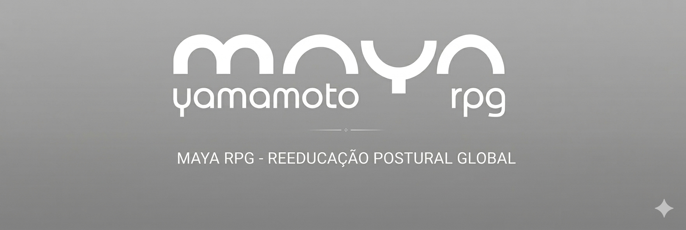

# FECAP - Fundação de Comércio Álvares Penteado

# Nome do projeto: Aplicativo Mobile – Maya RPG

## Nome do grupo: TechCare

## Integrantes: <a href="https://www.linkedin.com/in/victor-bancatelli/">Victor Bancatelli</a>, <a href="https://www.linkedin.com/in/nicolasnitta/">Nicolas Hayato Nitta</a>, <a href="https://www.linkedin.com/in/nelsonreisgomes/">Nelson dos Reis Gomes Souza</a>, <a href="https://www.linkedin.com/in/karine-aparecida-cardoso-alves-b903a2366/">Karine Aparecida Cardoso Alves</a>

## Professores Orientadores: <a href="https://www.linkedin.com/in/jefferson-o-silva/">Jefferson de Oliveira Silva</a>, <a href="https://www.linkedin.com/in/francisco-escobar/">Francisco Escobar</a>, <a href="https://www.linkedin.com/in/aimarlopes/">Aimar Martins Lopes</a>, <a href="https://www.linkedin.com/in/rodrigo-da-rosa-phd/">Rodrigo da Rosa</a>, 

## Descrição

O projeto consiste no desenvolvimento de um aplicativo de agenda integrado a um site institucional para a TechCare, com foco em otimizar o gerenciamento de horários e o atendimento ao cliente. A solução tem como objetivo facilitar tanto a organização da profissional Maya quanto a experiência dos clientes no agendamento de serviços.
  
O aplicativo permitirá o controle eficiente de horários, clientes e serviços, reduzindo conflitos de agenda e melhorando a produtividade. Já o site institucional será responsável por apresentar a Maya, seus serviços e a proposta da TechCare, transmitindo profissionalismo, confiança e praticidade para atrair e fidelizar clientes.
  
Dessa forma, o projeto busca unir tecnologia e organização para oferecer uma experiência simples, moderna e acessível, atendendo às necessidades tanto da profissional quanto de seu público.

## 🛠 Estrutura de pastas

-Raiz 
| 
|-->documentos 
  &emsp;|-->antigos 
  &emsp;|Documentação.docx 
|-->executáveis 
  &emsp;|-->windows 
  &emsp;|-->android 
  &emsp;|-->HTML 
|-->imagens 
|-->src 
  &emsp;|-->Backend 
  &emsp;|-->Frontend 
|readme.md 

A pasta raiz contem dois arquivos que devem ser alterados:

<b>README.MD</b>: Arquivo que serve como guia e explicação geral sobre seu projeto. O mesmo que você está lendo agora.

Há também 4 pastas que seguem da seguinte forma:

<b>documentos</b>: Toda a documentação estará nesta pasta.

<b>executáveis</b>: Binários e executáveis do projeto devem estar nesta pasta.

<b>imagens</b>: Imagens do sistema

<b>src</b>: Pasta que contém o código fonte.

## 📋 Licença/License
<a href="https://github.com/2026-1-NADS3/Projeto3">TechCare</a> © 2026 by <a href="https://example.com">Victor Bancatelli, Nelson Reis, Nicolas Nitta, Karine Cardoso</a> is licensed under <a href="https://creativecommons.org/licenses/by/4.0/">CC BY 4.0</a>

## 🎓 Referências

Aqui estão as referências usadas no projeto.
1. https://github.com/fecaphub/Template_PI

