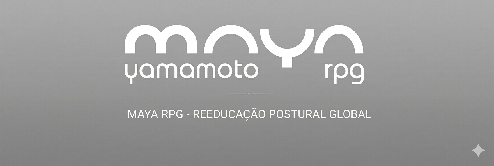

# FECAP - Fundação de Comércio Álvares Penteado

<p align="center">
<a href= "https://www.fecap.br/"></a>
</p>

# Nome do projeto: Sistema Mobile e Web - Maya RPG

## Nome do grupo: TechCare

## Integrantes: <a href="https://www.linkedin.com/in/victor-bancatelli/">Victor Bancatelli</a>, <a href="https://www.linkedin.com/in/nicolasnitta/">Nicolas Hayato Nitta</a>, <a href="https://www.linkedin.com/in/nelsonreisgomes/">Nelson dos Reis Gomes Souza</a>, <a href="https://www.linkedin.com/in/karine-aparecida-cardoso-alves-b903a2366/">Karine Aparecida Cardoso Alves</a>

## Professores Orientadores: <a href="https://www.linkedin.com/in/jefferson-o-silva/">Jefferson de Oliveira Silva</a>, <a href="https://www.linkedin.com/in/francisco-escobar/">Francisco Escobar</a>, <a href="https://www.linkedin.com/in/aimarlopes/">Aimar Martins Lopes</a>, <a href="https://www.linkedin.com/in/rodrigo-da-rosa-phd/">Rodrigo da Rosa</a>, 

## Descrição

<p align="center">

</p>


O projeto consiste no desenvolvimento de uma solução integrada para a Clínica Maya Yoshiko Yamamoto, com foco em Reeducação Postural Global (RPG). A solução reúne aplicativo Android para pacientes, módulo web para profissional/admin, backend REST e banco de dados.
<br><br>
O aplicativo permite que o paciente acesse o plano de exercícios prescrito, visualize orientações e mídias, registre execução dos exercícios, informe nível de dor e acompanhe sua evolução. O módulo web permite que a profissional gerencie pacientes, prontuários, banco de exercícios, prescrições, agenda e indicadores simples.
<br><br>
Dessa forma, o projeto centraliza dados clínicos e operacionais, melhora a comunicação com pacientes e apoia o acompanhamento contínuo do tratamento de RPG.


## 🛠 Estrutura de pastas

```text
Projeto3/
├── Documentos/
│   ├── Banner/
│   ├── Entrega1/
│   └── Entrega2/
├── Imagens/
└── src/
    ├── Entrega 1/
    │   ├── Backend/
    │   ├── Frontend/
    │   └── Mobile/
    └── Entrega 2/
        ├── backend/
        ├── mobile/
        └── web/
```

<b>Documentos</b>: relatórios, PDFs de UX, qualidade, cloud native, programação mobile e banner.

<b>Imagens</b>: imagens institucionais e materiais visuais do projeto.

<b>src</b>: código-fonte das entregas. A Entrega 2 contém a API NestJS, o app Android e o painel web React/Vite.

## 📋 Licença/License
<a href="https://github.com/2026-1-NADS3/Projeto3">TechCare</a> © 2026 by <a href="https://example.com">Victor Bancatelli, Nelson Reis, Nicolas Nitta, Karine Cardoso</a> is licensed under <a href="https://creativecommons.org/licenses/by/4.0/">CC BY 4.0</a>

## 🎓 Referências

Aqui estão as referências usadas no projeto.
1. https://github.com/fecaphub/Template_PI

